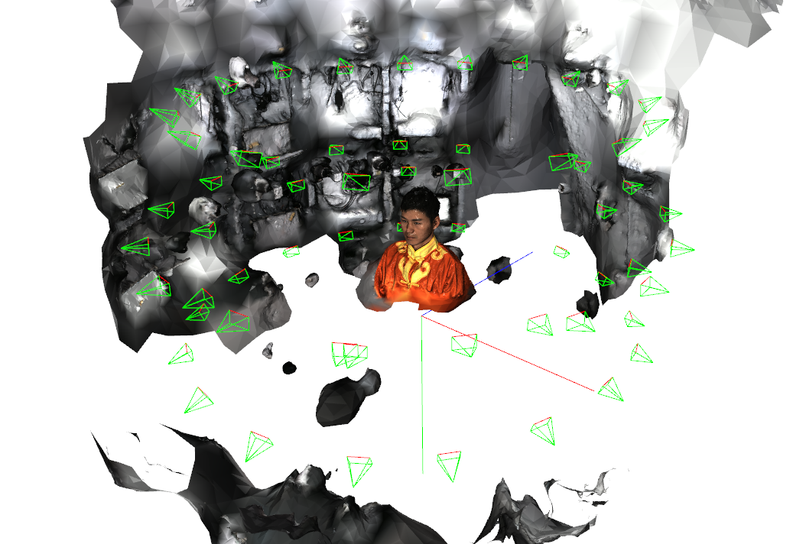

# MetashapeHandler

## Overview

MetashapeHandler provides an easy-to-use interface for performing photogrammetric 3D reconstruction using Agisoft Metashape. 

However, the tutorials are not provided well as much as the huge API document. Specially, importing pre-calibrated parameters as initial values is hard to implement because it is not officially supported.


This wrapper supports both from-scratch reconstruction and reconstruction with pre-calibrated camera parameters (intrinsics and extrinsics) for helping beginner of MetaShape.

There can be somewhat ambiguous things, then plaese let me know!

## Features

- **Flexible Reconstruction Quality**: Configurable calibration and mesh quality levels (0-4, from highest to lowest)
- **Pre-calibrated Camera Support**: Initialize reconstruction with known intrinsic and extrinsic camera parameters
- **Automated Pipeline**: Complete reconstruction workflow from images to textured mesh
- **Visualization Tools**: Built-in Open3D visualization for reconstructed meshes and camera poses
- **Coordinate System Management**: Handles transformation between Metashape's chunk region coordinate system and user-defined coordinate systems

## Installation

### Prerequisites

- Python 3.x
- Agisoft Metashape Python API
- Required Python packages:
  ```bash
  pip install numpy pillow trimesh open3d opencv-python
  ```

## Project Structure

```
MetashapeHandler/
├── src/
│   ├── reconstructor.py    # Main reconstruction class
│   ├── preprocessor.py     # Calibration data preprocessor
│   ├── visualizer.py       # Visualization utilities
│   └── utils.py            # Helper functions
└── scripts/
    ├── preprocess.py       # Example preprocessing script
    ├── reconstruct.py      # Example reconstruction script
    └── visualize.py        # Example visualization script
```

## Usage

### Preprocessing Calibration Data

If you have camera calibration data, convert it into this-repo-compatible format based on preprocessor:

```python
from src.preprocessor import Preprocessor

preprocessor = Preprocessor()
preprocessor.run(
    calib_path="path/to/calibration.json",
    save_dir="path/to/output"
)
```
It will output path/to/output/intrinsics and path/to/output/extrinsics that required in following reconstruction.

#### Calibration JSON Structure

The `calibration.json` file should contain camera parameters for each image:

```json
{
    "image_001": {
        "K": [fx, 0, cx, 0, fy, cy, 0, 0, 1],      // 3x3 intrinsic matrix (flattened)
        "dist": [k1, k2, p1, p2, k3],              // Distortion coefficients
        "T_gk": [...],                              // 4x4 extrinsic matrix (flattened)
        "img_w": 6000,                              // Image width
        "img_h": 4000                               // Image height
    },
    "image_002": {
        // ... same structure for each image
    }
}
```

Where:
- `K`: Camera intrinsic matrix containing focal lengths (fx, fy) and principal point (cx, cy)
- `dist`: Distortion coefficients [k1, k2, p1, p2, k3] for radial (k) and tangential (p) distortion
- `T_gk`: Camera-to-world transformation matrix (4x4)
- `img_w`, `img_h`: Image dimensions in pixels

You don't need to make calibration.json. Just refer it and update Preprocessor based on your data.

### Basic Reconstruction

```python
from src.reconstructor import Reconstructor

# Initialize reconstructor
recon = Reconstructor(
    calibration_level=0,    # 0-4: High to Low quality for feature extraction
    mesh_level=1,           # 0-4: High to Low quality for mesh generation
    texture_size=8192,      # Texture resolution (8K)
    bbox_dim=[5.0, 5.0, 5.0]  # Bounding box dimensions [width, height, depth]
)

# Prepare image paths
img_paths = ["path/to/image1.jpg", "path/to/image2.jpg", ...]

# Run reconstruction
save_dir = "path/to/output"
recon.run(img_paths, save_dir, init_dir=None)
```

### Reconstruction with Pre-calibrated Parameters

```python
# Use pre-calibrated camera parameters
recon.run(img_paths, save_dir, init_dir="path/to/calibration/folder")
```

The calibration folder should contain:
- `intrinsics/`: XML files with camera intrinsic parameters
- `extrinsics/`: NumPy files with camera extrinsic parameters

#### Intrinsics Folder Structure
```
intrinsics/
├── image_001_intrinsic.xml
├── image_002_intrinsic.xml
└── ...
```

Each XML file contains:
```xml
<calibration>
  <projection>frame</projection>
  <width>6000</width>
  <height>4000</height>
  <f>9000.0</f>           <!-- Focal length -->
  <cx>0.0</cx>            <!-- Principal point x offset -->
  <cy>0.0</cy>            <!-- Principal point y offset -->
  <k1>0.0</k1>            <!-- Radial distortion coefficient -->
  <k2>0.0</k2>            <!-- Radial distortion coefficient -->
  <k3>0.0</k3>            <!-- Radial distortion coefficient -->
  <p1>0.0</p1>            <!-- Tangential distortion coefficient -->
  <p2>0.0</p2>            <!-- Tangential distortion coefficient -->
  <date>2024-01-01T00:00:00Z</date>
</calibration>
```

#### Extrinsics Folder Structure
```
extrinsics/
├── image_001_extrinsic.npy
├── image_002_extrinsic.npy
└── ...
```

Each `.npy` file contains a 4x4 transformation matrix representing the camera-to-world transformation

### Visualization

```python
from src.visualizer import Visualizer

vis = Visualizer()
vis.run(save_dir, only_mesh=False)  # Show mesh with camera poses
```

## Quality Levels

The reconstruction quality is controlled by two parameters:

### Calibration Level (Feature Extraction)
- Level 0: No downscaling (highest quality)
- Level 1: 1x downscaling
- Level 2: 2x downscaling  
- Level 3: 4x downscaling
- Level 4: 8x downscaling (lowest quality)

### Mesh Level (Depth Map & Mesh Generation)
- Level 0: 1x downscaling (highest quality)
- Level 1: 2x downscaling
- Level 2: 4x downscaling
- Level 3: 8x downscaling
- Level 4: 16x downscaling (lowest quality)

## Output Structure

After reconstruction, the output directory contains:

```
output_dir/
├── mesh.obj                    # Reconstructed textured mesh
├── mesh_coord_changer.npy      # Transformation matrix for coordinate system
├── intrinsics/                 # Camera intrinsic parameters
│   └── {camera_name}_intrinsic.xml
└── extrinsics/                 # Camera extrinsic parameters (4x4 matrices)
    └── {camera_name}_extrinsic.npy
```

## Output Example
Thank you [Renderme360](https://renderme-360.github.io/index.html) !




Left image is from scratch and right image is from precalibrated settings.

## Key Components

### Preprocessor Class

Converts calibration data from JSON format to Metashape-compatible format:
- **Intrinsic Conversion**: Transforms camera matrix K to Metashape's XML format with focal length and principal point offsets
- **Distortion Parameters**: Handles radial (k1, k2, k3) and tangential (p1, p2) distortion coefficients
- **Extrinsic Export**: Saves camera-to-world transformation matrices as NumPy arrays
- **Principal Point Adjustment**: Automatically converts principal points to Metashape's offset format (relative to image center)

### Reconstructor Class

The main class for handling 3D reconstruction:
- **Feature Matching**: Configurable keypoint and tiepoint limits (default: 40000/10000)
- **Depth Map Generation**: Supports different filtering modes
- **Texture Generation**: Configurable texture size up to 8K resolution
- **Coordinate System Handling**: Manages transformations between Metashape's internal coordinate system and user coordinates
- **Pre-calibration Support**: Can initialize with known camera parameters for improved accuracy

### Visualizer Class

Provides visualization capabilities:
- Load and display reconstructed meshes
- Visualize camera poses in 3D space
- Apply coordinate transformations for proper alignment

### Utility Functions

Helper functions for:
- 3D transformations (`apply_T`)
- Camera frustum generation (`make_cam`)
- Coordinate system visualization (`make_origin`)

## Notes

- The wrapper implements a workaround for using pre-calibrated extrinsic parameters, as Metashape doesn't officially support this directly
- Processing time varies based on image count, resolution, and quality settings
- The reconstruction pipeline includes: feature extraction → camera alignment → depth map generation → mesh building → texture mapping

## License

This is a personal wrapper project. Please ensure you have appropriate licenses for Agisoft Metashape.